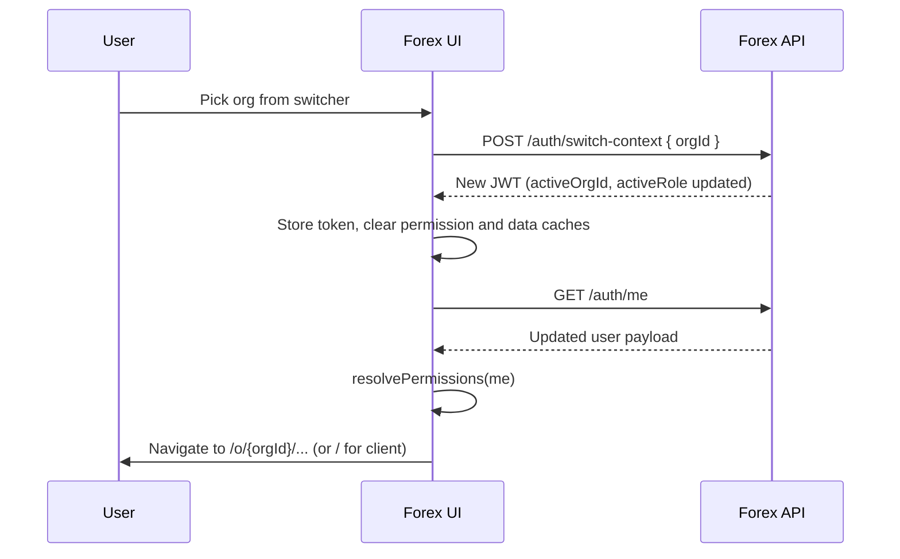

# Forex UI — Permissions & Organization Feature Handoff

> Internal handoff doc for the Forex UI team. Captures the **JWT / `/auth/me`
> response changes** the backend has shipped, and specifies the **UI work
> required**: a new permission-resolution rule based on `activeRole`, plus an
> end-to-end **organization feature** (org switcher UI + org-aware URLs).

- **Audience:** Forex UI engineers
- **Status:** Spec / handoff (no code in this repo)
- **Owner:** Conversation backend team
- **Last updated:** 2026-05-07

---

## 1. Summary of the API change

The decoded JWT (and the `/auth/me` payload it mirrors) now includes the
following fields in addition to the existing user profile:

| Field             | Type                       | Notes |
|-------------------|----------------------------|-------|
| `role`            | `"client" \| "organization_admin" \| "organization_user" \| ...` | The user's *base* role on the platform. |
| `permissions`     | `Permission[]` (root level) | The user's **personal / client** permissions. |
| `orgMemberships`  | `OrgMembership[]`          | Every org the user belongs to, each with its own role + permissions. |
| `activeOrgId`     | `string \| null`           | The org the user is currently "inside". `null` means personal/client context. |
| `activeRole`      | `"client" \| "organization_admin" \| "organization_user"` | The role the UI must use **right now**. Always trust this over `role`. |

Where:

```ts
type Permission = {
  platformId: { _id: string; name: string; status: string };
  accessLevel: ("view" | "edit")[];
  _id: string;
};

type OrgMembership = {
  orgId: { _id: string; name: string; status: string; createdDate: string };
  role: "organization_admin" | "organization_user";
  status: "active" | "inactive" | string;
  permissions: Permission[];
  _id: string;
};
```

**Headline change:** the Forex UI must stop reading permissions from a single
hard-coded location (the root `permissions[]`). Instead, the *effective*
permission set is derived from `activeRole` (+ `activeOrgId`).

---

## 2. Permission resolution rules (the core change)

Given a decoded token / `me` payload, compute the effective permissions for
the current session as follows:

1. If `activeRole === "client"` → use **root-level `permissions[]`**.
2. If `activeRole === "organization_admin"` or `"organization_user"`:
   - Find the membership where `orgMemberships[i].orgId._id === activeOrgId`.
   - Use **that membership's `permissions[]`** as the effective set.
   - If `activeRole === "organization_admin"` and the matched membership has
     `permissions: []`, treat as **full access** (admin override).
     *(Open question — see §6. Confirm with backend.)*
3. Fallbacks / safety nets:
   - `activeRole` missing or unknown → fall back to top-level `role` and root
     `permissions[]`. Log a warning.
   - `activeOrgId` set but no matching membership → treat as **no access** and
     redirect the user to the org switcher. Log a warning.
   - `orgMemberships[i].status !== "active"` → treat as no access for that
     org; do not auto-switch into it.

### Reference helper (drop-in for Forex UI)

```ts
type EffectivePermission = {
  platform: string;        // e.g. "Canva", "Flow", "Conversation"
  platformId: string;      // raw _id
  access: ("view" | "edit")[];
};

type MePayload = {
  role: string;
  permissions: Permission[];
  orgMemberships: OrgMembership[];
  activeOrgId: string | null;
  activeRole: string;
};

export function resolvePermissions(me: MePayload): EffectivePermission[] {
  const toEffective = (list: Permission[]): EffectivePermission[] =>
    list.map((p) => ({
      platform: p.platformId.name,
      platformId: p.platformId._id,
      access: p.accessLevel,
    }));

  if (me.activeRole === "client") {
    return toEffective(me.permissions ?? []);
  }

  if (
    me.activeRole === "organization_admin" ||
    me.activeRole === "organization_user"
  ) {
    const membership = me.orgMemberships?.find(
      (m) => m.orgId?._id === me.activeOrgId,
    );

    if (!membership || membership.status !== "active") {
      return []; // force user back to switcher
    }

    // Admin override (pending backend confirmation, see §6).
    if (
      me.activeRole === "organization_admin" &&
      (membership.permissions ?? []).length === 0
    ) {
      return [{ platform: "*", platformId: "*", access: ["view", "edit"] }];
    }

    return toEffective(membership.permissions ?? []);
  }

  // Fallback: legacy clients.
  return toEffective(me.permissions ?? []);
}

export function can(
  me: MePayload,
  platform: string,
  action: "view" | "edit",
): boolean {
  const eff = resolvePermissions(me);
  return eff.some(
    (p) =>
      (p.platform === "*" || p.platform === platform) &&
      p.access.includes(action),
  );
}
```

---

## 3. UI changes required in Forex

Concrete checklist for the Forex UI:

- **Auth / user store**
  - Persist `activeRole`, `activeOrgId`, `orgMemberships`, and root
    `permissions` from `/auth/me`.
  - Remove any assumption that `user.permissions` is the single source of
    truth.
- **Permission checks**
  - Replace every `user.permissions.find(...)` / direct read of
    `user.permissions` with `can(me, platform, action)` from §2.
  - Audit: route guards, sidebar / nav items, action buttons, conditional
    rendering, redirects.
- **Login & refresh flow**
  - On every login, token refresh, and `/auth/me` re-fetch, re-read
    `activeRole` + `activeOrgId` and re-derive permissions.
  - Clear any in-memory permission cache on token change or org switch.
- **Logout**
  - Clear `activeOrgId`, `activeRole`, `orgMemberships`, and all derived
    permission state.
- **Backwards compatibility**
  - If the API ever returns a payload without `activeRole`, fall back to
    `role` + root `permissions[]` so the app keeps working during rollout.

---

## 4. Organization feature (URL + switcher)

Two parts; both are required.

### 4.1 Org-aware URL

- All authenticated routes become **`/o/:orgId/...`** when an org is active.
  Personal/client routes stay at `/...` (no `/o/...` prefix).
- On app boot:
  1. Decode token / fetch `/auth/me`.
  2. If `activeOrgId` is set, ensure the current URL is under
     `/o/<activeOrgId>/...`. If not, redirect.
  3. If the URL contains an `:orgId` that does **not** match `activeOrgId`,
     trigger an org switch (see 4.2) before rendering.
- Deep-linking to `/o/<orgId>/...` while already logged in:
  - If `orgId` matches an entry in `orgMemberships` whose `status === "active"`
    → call the switch endpoint, then render.
  - Otherwise → redirect to the switcher and show an error toast.

### 4.2 Org switcher UI

- A dropdown / menu in the header showing:
  - **"Personal"** (client context) — only listed if the user has
    `permissions[]` at root or a `role` of `"client"`.
  - One entry per `orgMemberships[i]`, showing `orgId.name` and the user's
    `role` in that org (`organization_admin` / `organization_user`).
  - Disabled state for any org with `status !== "active"`.
- The currently active item is the one whose `orgId._id === activeOrgId`
  (or "Personal" when `activeOrgId === null`).
- On selection:
  1. Call backend switch endpoint
     `POST /auth/switch-context` with body `{ orgId: string | null }`.
     *(Exact path/payload to be confirmed — see §6.)*
  2. Backend responds with a **new JWT** whose `activeOrgId` and `activeRole`
     are updated.
  3. UI: replace the stored token, clear all permission / data caches,
     re-fetch `/auth/me`.
  4. Navigate to `/o/<orgId>/...` (or `/...` for personal/client). Default
     destination: the org's dashboard / home route.

### 4.3 Switch flow — sequence diagram



---

## 5. Worked examples

Both examples use the real tokens shared with this spec.

### Example A — Client context

Decoded token (excerpt):

```json
{
  "role": "client",
  "activeOrgId": null,
  "activeRole": "client",
  "permissions": [
    { "platformId": { "name": "Canva" },        "accessLevel": ["view", "edit"] },
    { "platformId": { "name": "Flow" },         "accessLevel": ["edit", "view"] },
    { "platformId": { "name": "Conversation" }, "accessLevel": ["edit", "view"] }
  ],
  "orgMemberships": [ /* ... */ ]
}
```

Resolution:

- `activeRole === "client"` → use root `permissions[]`.
- Effective permissions:
  - Canva: view, edit
  - Flow: view, edit
  - Conversation: view, edit
- URL: stays at `/...` (no `/o/...` prefix).

### Example B — Organization admin context

Decoded token (excerpt):

```json
{
  "role": "client",
  "activeOrgId": "69f98f95f0e8fad22d01b81a",
  "activeRole": "organization_admin",
  "permissions": [],
  "orgMemberships": [
    {
      "orgId": { "_id": "69f9b611491412910d71f63b", "name": "Vision Mital.vision", "status": "active" },
      "role": "organization_user",
      "status": "active",
      "permissions": [
        { "platformId": { "name": "Canva" }, "accessLevel": ["view"] },
        { "platformId": { "name": "Flow" },  "accessLevel": ["view"] }
      ]
    },
    {
      "orgId": { "_id": "69f98f95f0e8fad22d01b81a", "name": "Mital's Infotech", "status": "active" },
      "role": "organization_admin",
      "status": "active",
      "permissions": []
    }
  ]
}
```

Resolution:

- `activeRole === "organization_admin"`, `activeOrgId === "69f98f95f0e8fad22d01b81a"`.
- Find the matching membership → "Mital's Infotech" (`organization_admin`,
  `permissions: []`).
- Per the admin-override rule (pending backend confirmation), effective
  permissions are **full access** across that org's platforms.
- URL: `/o/69f98f95f0e8fad22d01b81a/...`.
- The other org ("Vision Mital.vision") still appears in the switcher; if
  the user picks it, the UI calls `/auth/switch-context` with that `orgId`
  and the new token's `activeRole` becomes `organization_user` with
  Canva/Flow `view` only.

---

## 6. Open questions for backend

- [ ] Exact path and request/response shape of the **org-switch endpoint**.
      The doc currently assumes `POST /auth/switch-context` with
      `{ orgId: string | null }` returning `{ token: string }`.
- [ ] Does `organization_admin` with `permissions: []` imply **full access**
      to all platforms for that org? (Currently assumed yes.)
- [ ] When `activeRole` is `organization_admin` / `organization_user`, should
      the root `permissions[]` be **ignored entirely**, or merged in any way?
      (Currently assumed: ignored.)
- [ ] Behavior when a membership has `status !== "active"`: silently hide,
      show disabled, or surface a specific error?
- [ ] Should `activeOrgId` ever be set when `activeRole === "client"`? If yes,
      what does that mean for the UI? (Currently assumed: never.)
- [ ] On token refresh, can `activeOrgId` / `activeRole` change without a
      user-initiated switch (e.g. backend revokes a membership)? If yes, the
      UI should detect and react.
